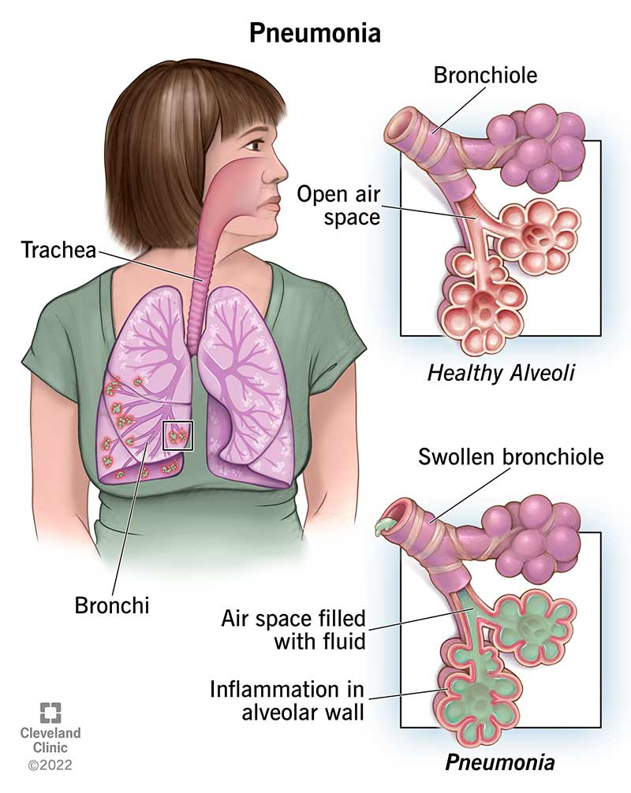
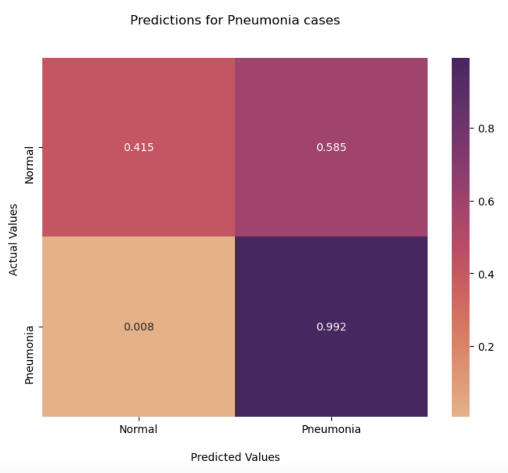

# Phase 4 Project: Pneumonia Classification

**Deanna Gould**  
Phase 4 Flex Student  
Instructor: Morgan Jones

**Table of Contents**  
[Overview](#Overview)  
[About the Data](#About-the-Data)  
[Project Strategy](#Project-Strategy)  
[Final Model](#Final-Model)
[Conclusions and Recommendations](#Conclusions-and-Recommendations)
[Contact](#Contact)

### Overview
HealthWorx is a telehealth company that would like to be able to diagnose patients with pneumonia from an X-Ray. X-Ray images can be taken in several locations, and this could decrease wait times for patients. Based on the [CDC Website](https://www.cdc.gov/nchs/fastats/pneumonia.htm), 41,309 people die from pneumonia each year, and 1.5 million people visit the emergency room with pneumonia as the primary diagnosis. Emergency rooms are known for their long wait times and becoming overcrowded, so this could also improve other patient's experiences. Pneumonia can have long-lasting effects on the health and well-being of patients. This jupyter notebook will take steps to predict whether a patient has pneumonia or not by using neural networks and image classification of X-Ray images. Although this wouldn't be able to completely replace a doctor's part in diagnosing the patient, this could be used as an added precaution.   

  
Diagram by: [Cleveland Clinic](https://my.clevelandclinic.org/health/diseases/4471-pneumonia)  

### About the Data
The dataset consists of 4,818 images for train data, 418 images for test data, and 624 images for validation data. Different algorithms like  will be used and each model will be tuned to determine the best model. Binary cross-entropy will be used as the loss function because this is a binary classification problem. For evaluation metrics, accuracy score, recall, and precision will be considered, but recall will be most important because pneumonia is a health-risk. Recall is the number of true positives divided by the number of true positives and false negatives. A false negative can be detrimental in healthcare settings. The dataset is from [Mendeley](https://data.mendeley.com/datasets/rscbjbr9sj/3), but a shortened version can also be found on [Kaggle](https://www.kaggle.com/datasets/paultimothymooney/chest-xray-pneumonia).  

### Project Strategy
  

Above is a diagram of neural networks. In this diagram, there are several inputs, and many hidden layers, but only one output, because there are only two classes. Below are X-Ray images of a patient with pneumonia, and a patient with a normal X-Ray.

  

Clearly, theses X-Rays can be difficult to interpret if you are not a healthcare professional who specializes in radiology. This is also why it's important to train the model without overfitting. Since images are three dimensional, it's important to have a model that is technical enough to handle them. This is where neural networks come in. There are different variations of models that can be made. I created a baseline model with CNN and 5-layers, and then iterated through different parameters. I also tested two different optimizers (adam and rmsprop), different learning rates, batch sizes, and more which can be seen in the notebook. Binary accuracy will be used to measure the success of the model, along with confusion matrices, and a cross entropy loss function. 

#### Histograms of X-Rays

Below is a histogram of a normal X-Ray.  

Below is a histogram of a Pneumonia X-Ray. It's clear that the pneumonia X-Ray has less pixels for the pixels than the normal X-Ray image.

  

### Final Model

The best performing model was my last model which was the Inception V3. The binary accuracy for the final epoch was 0.9937, while the binary accuracy for the validation set was 0.9656. Although I would've liked to have a closer binary accuracy score for the train and validation set, the model is still performing well on both sets.  

  

This is the final model architecture that was used to generate the conclusions below.

### Conclusions and Recommendations

Based on the results from the final Inception V3 model, it would be my recommendation to use Inception V3 for modeling. The Inception V3 model had a true positive rate of 99.2%, and a false negative rate of 0.8% when it was run on the test set. Even though this isn't perfect, especially because the false positive rate is so high, it is still suitable for a doctor to use as an aid or added tool, or to flag an initial diagnosis.  

In the future if there were more time for this deliverable, I would tweak different parameters to keep similar true positive rates, while lowering the false positives. Even with 99.9%, if this were applied to a country's population, it could still result in thousands of false negatives. This is why even though the percentage may be small, when it comes to healthcare cases, the percentages are more than numbers.  

In order to generate more information from this model, I would ask to see patient data in addition to the X-Ray images. Based on some of the X-Ray images, it does appear that some patient's look smaller. It is important to train the model on patient's of all ages, sexes, sizes, ethnicities, or even their smoking background. 

This could be very beneficial to the model, to help make sure that it truly is well-trained.

### Further Questions
For any further questions on this project, I can be reached on [Github](https://github.com/deannagould) or [Linkedin](https://www.linkedin.com/in/deanna-g-6037b018a/). 